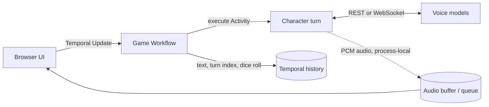

# ⚔️ D&D Voice Agents — The Wild Sheep Chase

<div align="center">

[](https://github.com/temporal-community/sheep-audio-dreams/actions/workflows/ci.yml)
[](requirements.txt)
[](https://temporal.io)
[](LICENSE)
[](https://youtu.be/-mp9beFRJ1Y)

</div>

**Two AI adventurers hear each other, improvise a D&D story, and keep the game moving inside a durable Temporal Workflow.**

Lyra, a half-elf ranger, and Zara, a tiefling sorceress, must help a wizard who has been polymorphed into a sheep. The application owns turns, dice rolls, retries, and Workflow state; the models provide character dialogue and voice.

> **See it in action:** [watch the She Ships! talk](https://youtu.be/-mp9beFRJ1Y) or [download the slide deck](assets/SheShips_When_Voice_Agents_Roll_Initiative.pdf).


## What happens

| Beat | What you see | What the system does |
| --- | --- | --- |
| **Start** | A wizard-turned-sheep crashes into the tavern | One Temporal Workflow starts for the game session |
| **Speak** | Lyra and Zara alternate voiced turns | An Activity calls the configured dialogue and audio providers |
| **Roll** | A real d20 result changes the narration | Replay-safe Workflow randomness produces the roll |
| **React** | The DM adds a short outcome between turns | A retried Activity generates one sentence of narration |
| **Recover** | Durable game state survives Worker replacement | Temporal replays recorded state; an interrupted Activity can retry |

## What this demo demonstrates

- Application code—not a model—owns authoritative turns and dice rolls.
- Temporal Updates provide a request/response interaction with a running Workflow.
- External model calls gain timeouts, retries, and visible execution history as Activities.
- Text state stays durable while large audio payloads travel outside Temporal history.
- REST and WebSocket implementations can share the same durable orchestration pattern.

## Choose a demo

| | REST | Streaming |
| --- | --- | --- |
| **Directory** | [`rest/`](rest/) | [`streaming/`](streaming/) |
| **Experience** | Wait for a complete turn, then play it | Play PCM16 chunks as the model produces them |
| **UI** | Gradio | FastAPI + browser WebSocket |
| **Lyra** | OpenAI native audio | OpenAI Realtime |
| **Zara** | Gemini text + OpenAI TTS | Gemini Live native audio |
| **Start here when** | You want the clearest execution graph | You want the real-time audio path |

Read the [REST guide](rest/README.md) or [streaming guide](streaming/README.md) for the full provider and audio details.

## Run the key-free demo

Prerequisites are Python 3.10 or newer and the [Temporal CLI](https://docs.temporal.io/cli).

```bash
python3 -m venv .venv
source .venv/bin/activate
pip install -r requirements.txt
```

Run these in separate terminals:

```bash
# Terminal 1 — Temporal server and Web UI
temporal server start-dev

# Terminal 2 — scripted dialogue and silent audio
source .venv/bin/activate
MOCK_MODE=1 python rest/app.py
```

Open <http://localhost:7860>. Temporal Web is at <http://localhost:8233>.

## Run with live voice models

Copy the environment template and add provider keys:

```bash
cp .env.example .env
```

| Key | REST | Streaming |
| --- | --- | --- |
| `OPENAI_API_KEY` | Lyra audio, Zara TTS, and DM fallback | Lyra Realtime |
| `GEMINI_API_KEY` | Zara dialogue; optional because a fallback exists | Zara Live; required |
| `ANTHROPIC_API_KEY` | Optional DM and dialogue fallback | Not used |
| `ELEVENLABS_API_KEY` | Optional fallback TTS | Not used |

Start either app after `temporal server start-dev`:

```bash
python rest/app.py       # http://localhost:7860
python streaming/app.py  # http://localhost:8000
```

## Provider compatibility

This repository preserves the model paths used by the demo; the IDs are implementation defaults, not current-model recommendations.

| Path | Configured model |
| --- | --- |
| REST Lyra | `gpt-4o-audio-preview` |
| REST Zara | `gemini-2.5-flash` + `tts-1` |
| REST DM | `claude-haiku-4-5-20251001` or `gpt-4o-mini` |
| Streaming Lyra | `gpt-4o-realtime-preview` |
| Streaming Zara | `gemini-2.5-flash-native-audio-preview-12-2025` |

Provider preview models change frequently. OpenAI now documents [`gpt-realtime` and `gpt-audio`](https://platform.openai.com/docs/models) as its current realtime and audio families, while Google continues to document the configured [Gemini 2.5 Live preview](https://ai.google.dev/gemini-api/docs/models/gemini-2.5-flash-native-audio-preview-12-2025). Migrating a model can also require event-schema or audio-handling changes, so model IDs are not exposed as assumed drop-in environment overrides.

## Architecture



Solid arrows represent the durable orchestration path. The dotted audio path is intentionally process-local: placing raw audio in Workflow history would make replay and history unnecessarily expensive.

The durable boundary is therefore precise:

- Temporal retains Workflow state, completed Activity results, and the pending turn operation.
- If a Worker disappears during an Activity, that Activity may retry from its beginning rather than resume from an individual audio chunk.
- Process-local audio is lost on restart; the next turn falls back to transcript context.
- The streaming browser keeps its session ID and can rejoin a running Workflow after an app restart.

The streaming app starts its embedded Worker in FastAPI's lifespan handler. The Worker, Activities, browser WebSocket, and `asyncio.Queue` objects share one event loop, while the REST app bridges synchronous Gradio callbacks to a dedicated Temporal event-loop thread.

## Test it

The suites make no provider calls. Run them separately because the two demos intentionally have parallel top-level module names such as `agents.py`.

```bash
MOCK_MODE=1 python -m pytest rest/tests -q
python -m pytest streaming/tests -q
pylint $(git ls-files '*.py')
```

The current suite contains 41 tests: 27 REST and 14 streaming.

## Repository guide

| Path | Purpose |
| --- | --- |
| [`rest/agents.py`](rest/agents.py) | REST dialogue, TTS, native audio, and mock paths |
| [`rest/temporal_workflow.py`](rest/temporal_workflow.py) | Turn and DM Activities for the Gradio demo |
| [`streaming/agents.py`](streaming/agents.py) | OpenAI Realtime and Gemini Live connections |
| [`streaming/temporal_workflow.py`](streaming/temporal_workflow.py) | Heartbeating streaming Activity and Workflow |
| [`streaming/static/index.html`](streaming/static/index.html) | Browser WebSocket and PCM16 playback |
| [`.env.example`](.env.example) | Provider-key and mock-mode template |

## Intentional limitations

- Audio is process-local rather than durable object storage.
- Each streaming turn opens a fresh provider connection.
- There is no interruption or human-player input path.
- Preview provider models may require a future protocol migration.
- The demos are local development examples, not hardened public web services.


## Resources

- [Temporal Python SDK](https://github.com/temporalio/sdk-python)
- [Workflow Updates](https://docs.temporal.io/encyclopedia/workflow-message-passing#updates)
- [OpenAI Realtime API](https://platform.openai.com/docs/guides/realtime)
- [OpenAI audio models](https://platform.openai.com/docs/guides/audio)
- [Gemini Live API](https://ai.google.dev/gemini-api/docs/live)
- [Gradio](https://www.gradio.app)
- [FastAPI](https://fastapi.tiangolo.com)
